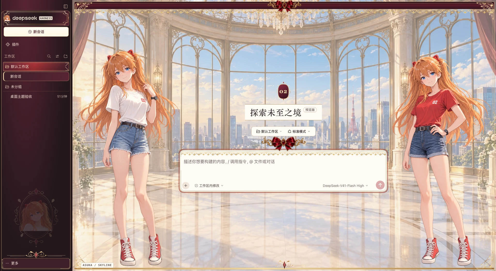
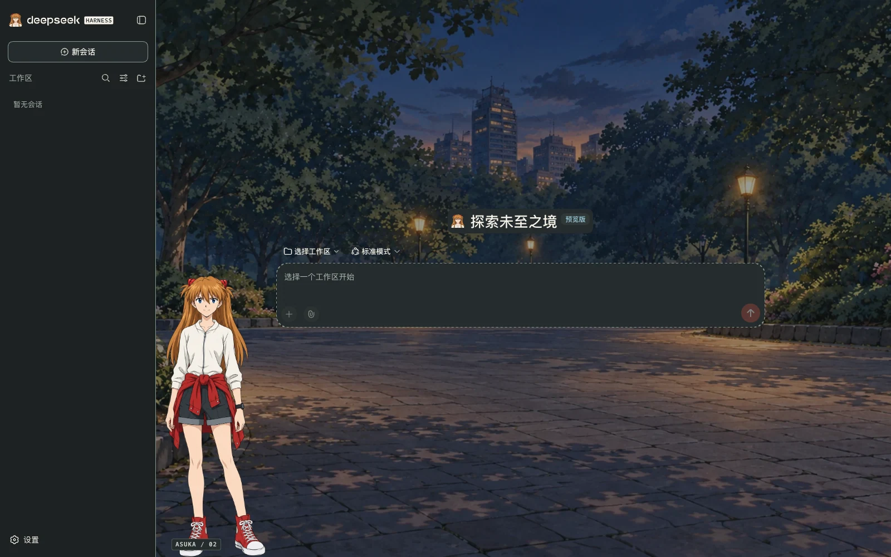
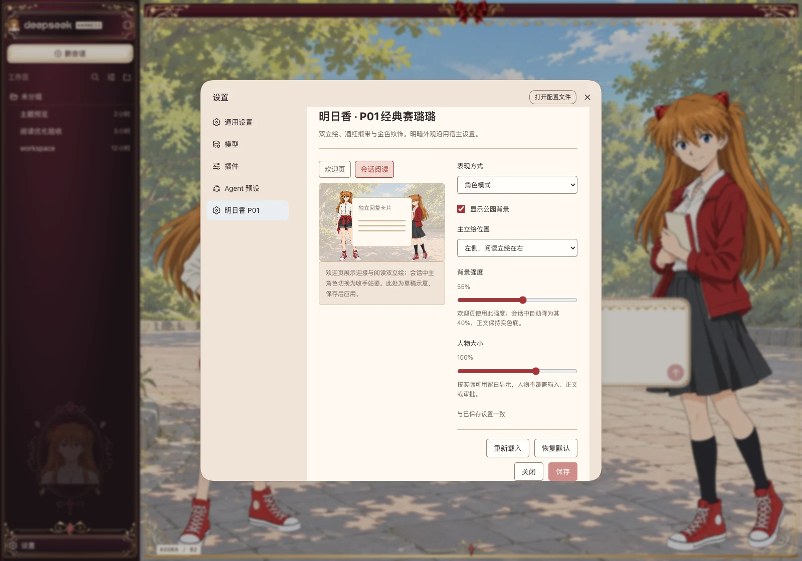

# 明日香 · 绯色天际

`dsh-skin-asuka-p01` 是 DeepSeek Harness 的独立皮肤组合包，采用精绘双人物、城市穹顶日夜场景、酒红金饰框架与独立回复卡片。面向桌面尺寸的 Harness Web 渲染界面，保留宿主会话、模型、工具与审批行为。

当前版本：`0.4.1`。已在官方 standalone `@deepseek-ai/dsh@0.1.5-rc.2` 的真实 Web 宿主中验证加载和主要设置行为。真实 Electron 桌面壳、`dsh-web-all` 与第三方皮肤管理器尚未实测；不能将 Web 验证等同于这些环境已兼容。

## 0.4.1 阅读与排版优化

- 默认正文和输入文字为 `16px / 28px`；正文相对宿主字号增加 `2px`，过程文字增加 `1px`，代码随宿主字号差值缩放。调整宿主字号仍然生效，插件不改写用户的字号偏好。
- 回复卡片上下留白为 `20px`；连续工具、过程条目间距为 `8px`，正文之间保留 `22px`。折叠思考和工具标题行同步增加高度，展开、复制和键盘操作保留原生行为。
- 工具差异预览使用 `14px / 22px` 代码字体，浅色新增行为深绿、删除行为暗红；深色模式采用对应的浅绿、浅红。配色仅作用于差异预览，不改动全局任务状态颜色。
- 阅读列默认最大 `920px`，继续支持宿主拖动调宽；会话输入框与正文列对齐，欢迎页输入框最大 `800px`。长代码和宽表格保留内部横向滚动。
- 浅色底座统一为暖灰，输入区保持不透明。会话背景在已保存强度的40%基础上进一步淡化中间区域，两侧保留建筑细节。
- 欢迎页双人物缩小并保持脚底对齐；宽屏会话人物默认最高 `420px`，实际尺寸继续受窗口、输入高度、侧边留白和用户比例限制。空间不足时隐藏人物，避免缩成很小的边角图像。
- 会话蝴蝶结与顶部预留收为 `36px`，保留主框、品牌铭牌和工作区缎带；减少普通控件的多层描边，并为窗口按钮预留顶部空间。

## 0.4.0 精绘人物与城市穹顶

按新的插画参考重画人物与环境，主题视觉更新为“绯色天际”。原有包名和 `asuka-p01` 设置命名空间保留，避免升级丢失偏好。

- 两侧人物采用细腻线条、通透蓝眼、橙红发丝高光和有层次的衣料阴影；白衣与绯红两套全身形象使用不同姿态，保持同一人物身份。
- 新人物轮廓适用于欢迎页和会话页，不再切回旧版赛璐璐站姿。头像也同步更新。
- 背景改为城市上空的玻璃穹顶大厅：落地窗、酒红帷幔、香槟金灯饰、石材倒影与远处城市形成纵深。日景为暖阳，夜景为蓝调与暖灯，建筑构图一致。
- 保留金饰角花、宝石缎带、品牌铭牌和独立实色回复卡片；场景负责氛围，文字和操作控件保留清晰底板。
- 欢迎页展示两张完整立绘；会话中按两侧真实空间等高缩放或独立隐藏，避免覆盖正文和输入区。
- 五项偏好、保存草稿、多窗口冲突处理及专注模式沿用原行为，不擅自覆盖用户设置。

从0.1.x–0.4.0升级时，停止对应profile，添加下方 **0.4.1** 安装包后重启并刷新客户端。旧版原图保留在源码素材目录，当前运行产物只使用精绘人物、穹顶背景和既有缎带。

## 功能

- 跟随宿主浅色、深色和跟随系统设置，不另建明暗偏好。
- 侧栏展示精绘头像，欢迎页展示 `02` 徽章；专注模式将侧栏头像切换为 `02` 标识。
- 欢迎页突出人物与主题装饰；会话页人物仅使用内容侧边的可用留白，空间不足时隐藏。
- 穹顶背景独立开关，支持人物左右位置、背景强度和人物大小。
- 自有设置页使用宿主 Host 设置持久化，草稿仅在页内预览，保存后才应用全局。
- 不改变模型人格、系统提示词、工具权限和审批决策；图片与样式随包交付，不依赖运行时图床。

## 预览

下列文件用于展示皮肤在实际宿主中的外观；验证范围以本文兼容性表为准。

| 浅色 | 深色 |
| --- | --- |
|  |  |



[浅色会话实测](preview/active-light.webp) · [深色会话实测](preview/active-dark.webp)（测试内容为本地离线生成的正文与代码，不是模型回复质量示例）。

[浅色代码差异](preview/diff-light.webp) · [深色代码差异](preview/diff-dark.webp)：展示新增、删除代码的独立配色与阅读层级。

## 安装到官方 standalone Harness

需要已安装可用的官方 `dsh` CLI，以及在 `PATH` 中可用的 `pnpm`。Node.js 要求为 `^22.19.0 || >=24.0.0`。以下命令以已验证的官方 `0.1.5-rc.2` 为基线；请在用户实际使用的 profile 中安装。

安装包文件为：

```text
dist/dsh-skin-asuka-p01-0.4.1.tgz
```

先停止准备安装的 Harness profile，然后执行：

```sh
dsh plugin --profile web add "/绝对路径/dsh-skin-asuka-p01-0.4.1.tgz"
dsh web --no-open
```

将示例路径替换为安装包的真实**绝对路径**；若实际 profile 不是 `web`，将命令中的 profile 名称换成实际名称，并使用 `dsh --profile <实际名称> --no-open` 启动。已有 `DSH_HOME` 配置时，安装和启动须使用相同环境。

打开启动日志中打印的本机 URL；若带有 `?token=…`，使用完整地址完成宿主浏览器认证。组合包成员变化需要重启对应 profile，再重新打开或刷新其界面。

官方 `0.1.5-rc.2` 的 Host 配置可热更新，但 Client HMR 不处理插件 graph 变化。因此，在已运行界面中启用或停用此皮肤后，**需要刷新客户端页面**才能使客户端组合重新加载；不承诺实时无刷新启停。

进入 **设置 → 明日香 P01**。能看到皮肤设置页且完成设置读取后，才表明客户端与 Host 设置通道均已就绪；仅安装成功不能代替这一步。

本包通过 `dsh.bundle.patch` 注册自己的 Host 插件，同时由 `dsh.client` 加载客户端。安装预构建 `.tgz` 无需用户在插件目录内运行构建命令。

官方 CLI 的 `desktop` profile 由 Electron 应用管理，不能把上述命令中的 `web` 直接替换为 `desktop`。本文没有提供未经验证的 Electron 安装步骤。

## 配置与保存

设置入口：**设置 → 明日香 P01**。设置命名空间为 `asuka-p01`，通过宿主 `settingsScope` 与 Host 通道保存，不使用 localStorage 作为权威存储。

| 设置 | 选项或范围 | 默认值 | 行为 |
| --- | --- | --- | --- |
| 表现方式 | 角色模式 / 专注模式 | 角色模式 | 专注模式隐藏人物、穹顶背景和角色头像，保留配色与 `02` |
| 显示穹顶背景 | 开 / 关 | 开 | 不影响人物和主题配色；专注模式下不可调整 |
| 主立绘位置 | 左侧 / 右侧 | 左侧 | 绯红立绘位于另一侧；会话中按各侧空间显示 |
| 背景强度 | 0–100% | 55% | 欢迎页采用此值；会话两侧采用其40%，中间进一步淡化，正文始终实色 |
| 人物大小 | 60–120% | 100% | 是期望比例，仍受窗口高度与实际留白限制 |

修改表单只改变**当前设置页的草稿预览**。点击“保存”后，客户端核对 Host 返回的有效值，再将其应用到工作区。

- **恢复默认**：先恢复默认草稿，再点击保存；不重置宿主明暗模式或字号偏好。
- **重新载入**：用当前 Host 已保存值替换本页草稿。
- **关闭或离开设置页**：尚未保存的草稿不会应用到工作区。
- **其他窗口已修改设置**：保留当前草稿并提示冲突；重新载入后再编辑，避免覆盖新值。
- **保存失败或结果未确认**：不显示成功，保留草稿；保存未结束时禁止重复提交。
- **设置未读取或连接不可写**：禁用保存；未确定用户偏好时先隐藏人物，避免闪现已关闭的角色。

明暗外观继续在宿主 **设置 → 通用 → 外观** 中调整。字号偏好继续由宿主管理，皮肤在此基础上调整正文、过程与代码的字号层级。模型和审批规则继续由宿主管理。

## 停用与卸载

仅希望暂时减少装饰，可将“表现方式”改为“专注模式”并保存；此时主题配色仍然生效。

需要卸载时，先停止对应 profile，再执行：

```sh
dsh plugin --profile web remove dsh-skin-asuka-p01
dsh web --no-open
```

同样将 `web` 替换成实际安装的 profile。卸载后重启该 profile，使组合包列表重新生效。本插件没有删除会话、用户草稿或清空宿主设置文档的逻辑；也不会主动删除 Host 中已有的 `asuka-p01` 历史偏好。

**官方 `0.1.5-rc.2` 启停皮肤后需要刷新客户端。** 该版本的 Host 配置热更新正常，但客户端不热处理插件 graph 变动；仅点击停用不能视作当前页面已经撤销皮肤。已验证刷新后人物图层、皮肤样式、头像和专属 body 标记全部移除，重新启用后保持单实例。需要移除本次加载时，可采用上述停止、移除、重新启动流程。

## 兼容性与已验证范围

| 环境或行为 | 当前状态 |
| --- | --- |
| 官方 standalone `@deepseek-ai/dsh@0.1.5-rc.2` 真实 Web 宿主加载 | 已验证 |
| 五项设置保存、保存后页面重载恢复 | 已验证 |
| 多窗口设置更新与冲突处理 | 已验证 |
| 深色界面、窄窗口下人物让位 | 已验证 |
| 无刷新即时启停 | 官方 `0.1.5-rc.2` 不热处理 Client graph 变化；启停后须刷新客户端 |
| 启停后刷新客户端的完整撤销检查 | 已验证：人物、样式、头像与标记移除，重新启用为单实例 |
| Host 进程退出并重新启动后的设置恢复 | 已验证 |
| 独立 profile 从 `.tgz` 安装并加载 | 已验证 |
| 已有会话正文、代码块与输入框的人物避让 | 已在离线历史会话中验证，浅深色均无覆盖 |
| 1024 / 1280 / 1600 / 1920px 桌面布局 | 已验证：阅读列、输入框对齐，人物按空间显示或隐藏 |
| 工具差异新增/删除颜色、展开与长行滚动 | 已验证：浅深色对比度均高于4.5:1，完整内容可展开、横向查看 |
| 宿主字号与内容宽度调整 | 已验证：字号联动，原生拖动调宽继续生效 |
| 官方 Electron 桌面壳及其专用插件入口 | 未实测 |
| `dsh-web-all` | 未实测 |
| 第三方皮肤管理器 | 未实测 |
| 其他 Harness 版本或发行版 | 未纳入已测清单 |

`skin.json` 提供包名、标识、预览和 wiring 等发现元数据，便于能识别该格式的管理器发现皮肤；它不代表已完成管理器联调。本包没有自定义 manager 配置 bridge，配置入口仍是“设置 → 明日香 P01”。

人物和背景目前通过限定在会话列的 DOM 适配插入，依赖已测试版本的会话、输入和阅读区域标记。它们不是 Harness 永久稳定的场景插槽 API。宿主升级后若标记变化，适配会在无法确认位置时隐藏人物；需要重新核对可用空间、弹层和输入避让。不要把旧版高保真设计图中的全部构图视为本插件已实现效果。

## 从源码构建

在此源码目录中执行：

```sh
npm ci
mkdir -p dist
npm pack --pack-destination dist
```

`npm pack` 会自动执行 `prepack`，依次进行 TypeScript 检查与构建，生成 `dist/dsh-skin-asuka-p01-0.4.1.tgz`。如果只需要查看构建产物而暂不打包，可单独执行：

```sh
npm run typecheck
npm run build
```

构建流程将 `assets/source/` 中的精绘人物和穹顶素材编码为 WebP，并内嵌至客户端产物。构建保留源素材，输出 `lib/index.js` 和 `lib/client.js`；浏览器产物使用 Harness module-loader factory 格式，React、Cordis 和宿主 UI 共享模块保持 external，不打入第二份运行时。

目录职责：

```text
src/index.ts              Host 设置 schema 和 namespace 注册
src/preferences.ts        五项偏好、默认值与输入校验
src/client/index.tsx      主题覆盖、品牌位与设置入口
src/client/settings.tsx   草稿、预览、保存与冲突处理
src/client/scene.ts       会话列人物/背景适配及资源清理
src/client/theme.css      色板、人物场景、回复卡片与设置页
src/client/chrome.css     侧栏、标题栏、输入框与装饰边框
src/client/ornaments.ts   原创金属角花、边饰与铭牌SVG
assets/source/            历版原图、当前精绘人物、穹顶背景与宝石缎带
scripts/build.mjs         编码资源并输出 Host / Client 产物
lib/                      已构建产物
preview/                  浅色、深色与设置页预览
cordis.patch.yml          组合包 Host 注册层
skin.json                 可选管理器发现元数据
```

npm 安装包只包含 manifest 的 `files` 清单所列运行产物和说明，不包含 `node_modules`、源码素材目录或验证脚本。包内 `lib/client.js` 含内嵌美术资源，仍适用下方素材许可边界。

## 常见问题

**安装后没有皮肤或设置入口**：确认安装和启动使用同一 `DSH_HOME` 与 profile；重启 profile 后重新打开界面，检查宿主报告的 Host / Client 加载错误。不要仅凭包已出现在插件列表中判断客户端已加载。

**有头像和颜色，没有全身人物**：检查角色模式、人物位置和窗口宽度。人物只使用真实留白；右侧预览占用空间、窄窗口或宿主标记不匹配时隐藏人物属于当前避让策略，不会强行盖在正文上。

**修改预览后工作区没有变化**：设置仍是草稿，需要点击保存并等待确认。

**提示设置不可写或保存未确认**：从本机 Harness 连接使用，检查宿主连接；连接恢复后重新载入有效值。插件不会静默改为另一种存储方式。

**与其他主题混色**：关闭其他全局皮肤后重新启动对应 profile；本包没有主题互斥管理器，也不自动卸载其他插件。

## 许可与素材说明

本项目原创代码采用 MIT License，见 [LICENSE](LICENSE)。人物、背景、预览以及构建产物中的内嵌美术资源**不属于代码 MIT 授权范围**，来源及边界见 [NOTICE](NOTICE)。

本皮肤是 EVA / 明日香的非官方同人主题，与相关权利方、DeepSeek 或 Harness 官方不存在官方授权、背书或合作声明。

## 开发参考

接入依据为 [Harness 插件开发文档](https://deepseek-harness.github.io/deepseek-harness/develop/basic/)；参考了 [Deep Whale 主题仓库](https://github.com/Small-tailqwq/dsh-deep-whale/blob/main/README.en.md) 的独立组合包、皮肤发现元数据与场景分层方式。本包未使用该仓库的人物或背景图片。

参考主题：[maid-atelier](https://github.com/Small-tailqwq/dsh-deep-whale/tree/main/maid-atelier)。本轮沿用其视觉分层思路，代码与几何装饰为本项目实现。
